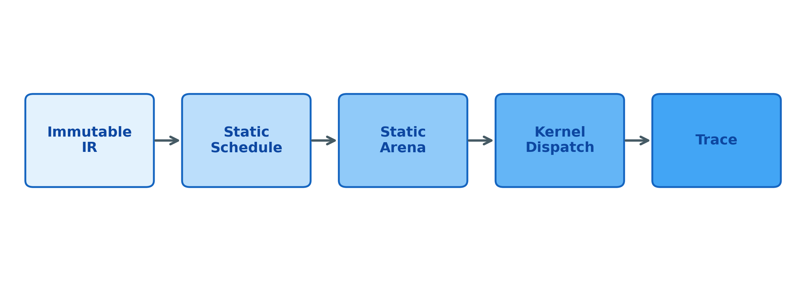
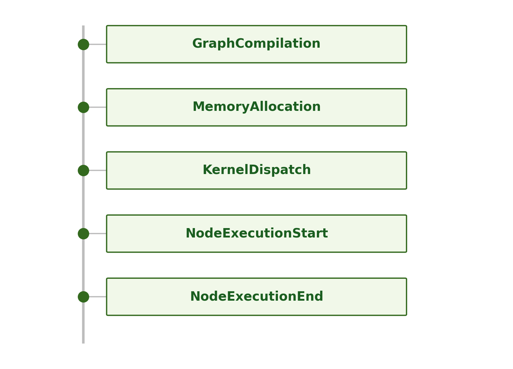

# Summary

VECTORIA is a deterministic computational engine designed to bridge the gap between high-level neural architectures and bit-exact numerical execution. The engine provides a comprehensive suite of inference primitives governed by a normative C++ reference standard to ensure mathematically consistent behavior across scientific pipelines. Unlike traditional frameworks that often sacrifice numerical stability for heuristic performance, VECTORIA prioritizes auditable "Numerical Truth." By emitting first-class execution traces for every kernel dispatch and memory allocation, it enables formal reproducibility and provenance in safety-critical AI systems [@ieee754].

# Statement of Need

Scientific reproducibility is frequently compromised by the non-deterministic nature of modern computational frameworks. High-performance libraries (e.g., OpenBLAS, MKL) and deep learning engines (e.g., PyTorch) often employ optimizations, such as dynamic threading and floating-point reordering, that introduce subtle but cumulative numerical drift. For researchers in fields like genomics, climate modeling, or cryptographic verification, these discrepancies can result in irreproducible outcomes where state divergence occurs across identical runs on the same hardware.

VECTORIA addresses these gaps by externalizing reliability as a managed system property. It provides a stable, traceable, and bitwise-reproducible environment for executing numerical graphs without the overhead of heavy formal verification. By mapping high-level semantic blocks to a fixed set of certified kernels, it ensures that every execution path is deterministic and auditable. This is critical for scientific inference where the "provenance" of a result, defined as the exact sequence of operations and kernels used, is as important as the result itself.

# State of the Field

The landscape of computational frameworks is characterized by systems optimized for high-throughput tensor operations and automated differentiation. NumPy [@numpy] provides the foundational array-based abstractions for scientific computing in Python. Deep learning frameworks such as TensorFlow [@tensorflow] and PyTorch [@pytorch] extend these concepts with dynamic graph execution and highly optimized kernels for hardware acceleration. Standards like ONNX [@onnx] and compiler stacks such as MLIR [@mlir] and Apache TVM [@tvm] address the challenges of portable optimization and hardware abstraction. Performance libraries like OpenBLAS [@openblas] provide tuned implementations of linear algebra primitives.

VECTORIA occupies a distinct design subspace by prioritizing numerical determinism and execution transparency over heuristic optimization. Unlike frameworks that utilize dynamic thread scheduling or implicit kernel selection, VECTORIA enforces an immutable execution model. It distinguishes between bitwise determinism, which is guaranteed intra-platform (same binary, same hardware), and numerical reproducibility across different architectures. In the latter case, execution is subject to bounded drift. This drift arises from variations in IEEE-754 rounding [@ieee754], hardware-specific Fused Multiply-Add (FMA) contraction, and variations in reduction associativity (e.g., linear versus tree accumulation). By tethering all optimized kernels to a Scalar C++ Reference Implementation, VECTORIA provides a mechanism for formal provenance in scientific inference.

# Software Design & Architecture

VECTORIA is structured into four distinct layers: Assembly (Optimized Kernels), C++ Core (IR and Engine), Lowering (CoreML Export), and High-Level Bindings (Python/Swift).

### Execution Lifecycle

The VECTORIA execution lifecycle (Figure 1) is designed to eliminate all sources of non-determinism through a strict "Compile-Schedule-Execute" pipeline.

1.  **Graph Construction**: Users define computation using high-level bindings. Python acts as a control surface, ensuring that no heavy computation or data conversion happens within the interpreted layer.
2.  **IR Freezing**: The graph is serialized into a static C++ Intermediate Representation (IR). Once constructed, the topology and data types are immutable. VECTORIA IR explicitly forbids in-place mutation and dynamic shapes to ensure the execution path is fixed at compile-time.
3.  **Static Scheduling**: During compilation, the Engine validates graph invariants and linearizes the nodes into a fixed execution schedule.
4.  **Arena Memory Planning**: The `MemoryModel` calculates the exact peak memory requirement for every tensor and assigns fixed byte offsets within a contiguous `Arena`. This eliminates runtime allocation noise and fragmentation.
5.  **Kernel Dispatch**: The Engine dispatches kernels based on an explicit **Kernel Policy**. Users must explicitly opt-in to SIMD optimizations; no implicit or "auto-magic" selection is performed.
6.  **Trace Emission**: Every operational decision, including memory offsets and kernel variants, is recorded as an auditable trace event.

### The Arena Memory Model

To maintain strict control over the hardware state, VECTORIA eschews garbage collection and reference counting. The `Arena` allocator carves out memory sequentially from large system blocks. Sub-allocations are never individually freed; the entire block is released only when the session is reset. This bump-pointer strategy ensures that for a given input sequence, memory addresses and layouts remain bit-identical across runs. This model provides predictable performance and simplifies the boundary between C++, Assembly, and Swift, ensuring that pointers remain stable throughout the execution lifetime.

### Semantic Composition & The "Semantic Freeze"

High-level operations such as `LayerNorm`, `Attention`, and `TransformerEncoder` are implemented through **Pure Semantic Composition**. They do not exist as monolithic, opaque kernels but are expanded into auditable subgraphs of primitives during graph construction.

*   **LayerNorm**: Expanded into `ReduceSum`, `Sub`, `Mul`, `Sqrt`, `Add`, and `Div` nodes. It handles population variance (dividing by $N$, not $N-1$) and supports broadcast-aware scaling via learnable $\gamma$ and $\beta$ parameters.
*   **Scaled Dot-Product Attention**: Expanded into `Transpose` (for Keys), `MatMul` (Scores), `Mul` (Scaling), `StableSoftmax`, and a final `MatMul` (Context). 
*   **Multi-Head Attention (MHA)**: Decomposed into projection matrices, head-splitting (via `Reshape`, `Transpose`, and `Slice`), per-head attention triplets, and a final `Concat` and output projection.

The semantic surface of these operations is **frozen**. VECTORIA guarantees that the expansion logic and numerical expectations for these blocks will remain stable across versions. Any future optimizations, such as kernel fusion, must prove bitwise identity to these frozen reference expansions.

# Structural Integrity & Data Movement

To maintain absolute transparency, VECTORIA treats structural operations (e.g., `Transpose`, `Reshape`, `Concat`, `Slice`) as first-class citizens in the IR. These operations manipulate tensor shape and layout without performing arithmetic.

1. **Transpose**: Reorders axes using a permutation vector. It is implemented via deterministic index mapping in the reference backend.
2. **Reshape**: Reinterprets the linear memory buffer with a new shape. To avoid complex memory aliasing bugs and maintain strict ownership boundaries, the reference implementation performs a strict copy.
3. **Concatenation**: Joins multiple tensors along a specified axis. It is a prerequisite for Multi-Head Attention, allowing independent head outputs to be unified into a single representation.
4. **Slicing**: Extracts sub-tensors along a specified axis. 

By materializing the outputs of these structural operations rather than using zero-copy "views," VECTORIA avoids non-deterministic memory access patterns and ensures that every step of the data movement is recorded in the trace.

# Observability & Scientific Provenance

Tracing in VECTORIA provides evidence of exactly how a result was calculated (Figure 2). A trace is a first-class deployment artifact that enables formal provenance.

The integrated `Tracer` captures nanosecond-precision timestamps and explicit dispatch modes. In a canonical walkthrough of a `TransformerEncoder`, the trace reveals the full sequence of projections and structural operations. This eliminates the "hidden computation" common in other frameworks. The `vectoria-trace` suite provides standalone Python tools to analyze these traces, diff them for determinism verification, and visualize the execution flow. 

# Deployment & CoreML Lowering

VECTORIA treats deployment not as an export feature but as a **contract** [@coreml2024]. Through `ExecutionMode::Deployment`, the framework ensures that research graphs intended for production adhere to strict structural constraints. 

When this mode is active, the Engine:
1.  **Strictly Validates Operations**: Rejects any graph containing operations not supported by the target backend (e.g., Apple Neural Engine).
2.  **Enforces Semantic Equivalence**: Validates that the lowered graph will behave mathematically identically to the C++ reference execution.
3.  **Lowering to MIL**: The lowering process translates the immutable IR directly into Apple's Model Intermediate Language (MIL), mapping VECTORIA types to CoreML primitives (e.g., `fp32` and `matmul`).

# Performance Model & Benchmarking

VECTORIA aims to be **predictably fast** rather than heuristically optimized. The performance model is interpreted through the lens of memory bandwidth vs. compute intensity.

### Compute-Bound Operations
For `MatMul` (GEMM) operations, VECTORIA targets the theoretical peak throughput of host SIMD lanes. The optimized assembly path implements register blocking to hide FMA latency, targeting $>80\%$ of peak theoretical FLOPS for the given instruction set.

### Memory-Bound Operations
Elementwise operations are limited by RAM-to-cache bandwidth. SIMD implementations for these operations focus on reducing instruction overhead, typically yielding speedups of 1.1x to 1.5x over autovectorized C++.

### Benchmarking Policy
VECTORIA maintains a strict "no marketing" benchmarking policy. Performance is measured solely for regression testing. Benchmarks are always run on a single thread to minimize variance and ensure results are reproducible on local developer hardware.

# Implementation & Toolchain Assumptions

To maintain the deterministic guarantees defined in `TRUTH.md`, VECTORIA assumes the following toolchain and hardware constraints:

*   **C++ Standard**: Strictly C++17 compliant.
*   **Python Runtime**: Version 3.8 or later, used as a control surface.
*   **Swift Environment**: Version 5.5 or later for Apple platform integration.
*   **SIMD Architectures**: Validated for ARM64 NEON and x86_64 AVX2 using architecture-aware CI runners.
*   **Floating Point**: Strictly IEEE 754 single-precision (FP32). 

# Testing & Continuous Validation

VECTORIA uses Continuous Integration (CI) as a formal **Correctness Proof**. Every commit triggers architecture-aware testing on native hardware. The test suite is divided into bitwise identity tests for reference kernels, a SIMD validation harness for optimized paths, and determinism stress tests that perform 50+ repeated executions of complex multi-op graphs to detect transient failures or state leaks.

# Research Impact

VECTORIA provides a foundation for "Reliable AI" research by enabling a separation between model-level instability and framework-level numerical noise. In computational genomics, where variant calling depends on subtle probability shifts, the framework ensures that results remain consistent regardless of the underlying hardware optimization. Similarly, in cryptographic verification and formal methods, the ability to reconstruct an execution state with bitwise identity to a scalar reference allows for the construction of "provenance-aware" inference loops. By enforcing a strict contract between research code and production deployment, VECTORIA reduces the audit burden for system engineers moving complex models into safety-critical environments.

# Future Work

Future development of the VECTORIA framework will focus on the following key areas:
1. **Quantized Inference Paths**: Introduction of Int8 support to enable deployment in memory-constrained environments while maintaining bitwise identity to quantized reference standards.
2. **Deterministic Parallelism**: Exploring static data-partitioning strategies to introduce multi-threading without compromising the bitwise reproducibility of results.
3. **Extended Tensor Semantics**: Supporting more general broadcasting rules and high-rank tensor operations beyond the current row-wise vector primitives.

# Determinism Boundaries

Table 1: Determinism Guarantees & Boundaries

| Boundary | Guarantee | Rationale |
| :--- | :--- | :--- |
| **Intra-Platform** | Bitwise Identical | Fixed binary, fixed hardware, single-threaded serial engine. |
| **Cross-Architecture** | Bounded Drift | Differences in FMA instructions and register widths (ARM vs x86). |
| **Binary Recompilation** | Bounded Drift | Variations in compiler-specific instruction scheduling and reordering. |

# Operation Support

Table 2: Kernel Support Matrix

| Category | Operations | Execution Backends |
| :--- | :--- | :--- |
| **Elementwise** | Add, Sub, Mul, Div, ReLU, Exp, Sqrt, Log | Reference, SIMD (Add, Mul, Sub, Div, ReLU) |
| **Reduction** | ReduceSum, ReduceMax | Reference, SIMD (ARM64 NEON, x86_64 AVX2) |
| **Linear Algebra** | MatMul (GEMM) | Reference, SIMD (ARM64, x86_64) |
| **Structural** | Transpose, Reshape, Concat, Slice | Reference |
| **Neural** | Softmax, LayerNorm, MHA, TransformerEncoder | Composed Semantic Expansion |

# Availability

- **Repository**: [https://github.com/Sulkysubject37/VECTORIA](https://github.com/Sulkysubject37/VECTORIA)
- **License**: MIT
- **Version**: v1.3.2-stable

# AI Usage Disclosure

Generative AI (Gemini 2.0) was used to structure this manuscript and ensure adherence to JOSS formatting requirements. All technical claims, operation sequences, and numerical guarantees were verified against the VECTORIA v1.3.2-stable source code.

# References